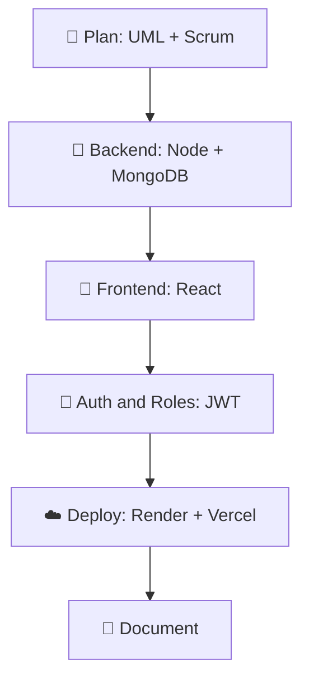

## Hi there 👋
<!-- ============ HEADER BANNER ============ -->

 

 

## 👨‍💻 About Me

I'm a developer completing an internship at a company in Tunisia 🇹🇳. I build complete web applications **end to end**: architecture, REST APIs, user interfaces, and production deployment.

- 🏅 **Certified in my field**, backed by multiple professional certifications
- 🏥 Delivered **professional apps** in healthcare, logistics, and public transport
- 🔭 Specialized in the **MERN stack**
- ☕ Also developing in **Java** (and its frameworks), **C**, and **Python**
- 🧱 Authentication, role-based access, and real-time features
- 📐 I document my work: UML, Agile/Scrum, technical reports
- 🌍 Working languages: **Arabic · French · English**

| ⚡ Quick Facts | |
|---|---|
| 🏅 **Status** | Certified |
| 🎯 **Focus** | Full-Stack Web |
| 🧰 **Stack** | MERN · Java |
| 💻 **Also** | C · Python |
| 🏗️ **Projects** | 5+ shipped |
| 🗣️ **Languages** | AR · FR · EN |
| 📍 **Based in** | Tunisia |

---

## 🛠️ Tech Stack

**Core: MERN**

**Languages & Frameworks**

<!-- Java frameworks: once you tell me which ones (e.g. spring, hibernate, maven), add their icon ids to the list above. -->

**Tools & Deployment**

 

---

## 🚀 Featured Projects

### 🏥 Medical Appointment App
`Healthcare` · `Freelance` · `Back-End`

Professional medical application built with an independent freelance team (Jan–Jun 2026).

- 📅 Appointment booking
- 🛠️ Admin management
- 💊 Treatment tracking

### 📦 Shipping App
`Logistics` · `Professional`

A professional shipping application built as part of my professional work.

<!-- TODO: add 3 bullets with the real features, for example:
- 🚚 feature one
- 📍 feature two
- 📊 feature three
and list the stack used -->

### 🚌 Transtu
`Public Transport` · `MERN`

Ticketing platform modeled on the real Tunisian TRANSTU network.

- 🧭 BFS-based route search
- 🔐 JWT multi-role auth and dashboards
- 🔔 Socket.io real-time notifications
- ☁️ Render + Vercel + MongoDB Atlas

### ✅ TaskFlow
`Productivity` · `MERN`

Task and project manager built from a detailed spec.

- 🗂️ Kanban-style board
- 🔐 JWT auth and full CRUD
- 📊 Admin dashboard
- 🎨 Custom CSS design system, no UI framework

### ⚖️ Tunisian Digital Law
`Legal Tech` · `Arabic`

Interactive Arabic web app making Tunisian digital legislation easier to explore: Decree 54, Data Protection Law (No. 63/2004), and Access to Information Law (No. 22/2016).

<!-- OPTIONAL: pin cards for your best repos. Replace REPO_NAME, then remove the comment markers.

  
  

-->

---

## 🧩 How I Build

---

<!-- CERTIFICATIONS: fill in, then remove the opening and closing comment markers so the section shows.

## 🏅 Certifications

| Certification | Issuer | Year |
|---|---|---|
| Certification name | Issuer | 2026 |
| Certification name | Issuer | 2026 |
| Certification name | Issuer | 2025 |

---
-->

## 📚 Learning & Technical Writing

<b>Tap to expand</b>

 

- 📘 French-language guide to **80x86 assembly**: architecture, memory segmentation, registers, DOS interrupts, with diagrams and exercises
- 📐 UML modeling, Agile/Scrum planning, and internship reporting
- 🐘 Exploring **Laravel** (MVC, Eloquent ORM) alongside the MERN stack

---

## 📊 GitHub Stats

<b>More activity</b>

 

---

## 🤝 Let's Connect

I'm open to **internships, collaborations, and exciting projects**. Let's build something great together!

⭐ *If you like my work, explore my repositories and leave a star!*

